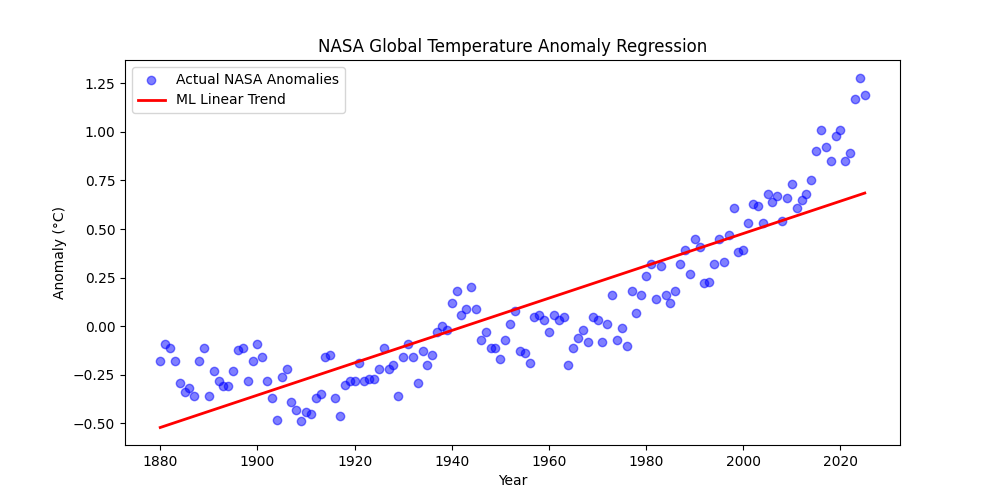

# NASA Climate Anomaly Prediction

An individual data science experiment running predictive analytics on global climate data. 

## Project Overview
This project uses the official [NASA GISS Surface Temperature Analysis (GISTEMP v4)](https://data.giss.nasa.gov/gistemp/data_v4.html) dataset to track global land-ocean temperature anomalies from 1880 to the present.

## Implementation Details
* **Data Processing:** Cleans and structures raw climate observations using `pandas`.
* **Machine Learning:** Trains a classical `scikit-learn` Linear Regression baseline model to map long-term global thermal fluctuations.
* **Visualization:** Exports statistical regression trends directly using `matplotlib`.

## Model Evaluation Output

